# 🗄️ Awesome Database GUI & Development Tools 🚀

  

  
  
  
  

---

## 📌 Overview & Category Insights

Welcome to the ultimate curated directory of **Database GUIs, SQL Editors, Schema Management Platforms, and Data Modeling Tools**. Whether you are looking for enterprise-grade proprietary clients or lightweight open-source SQL editors, this repository categorizes top-tier solutions for PostgreSQL, MySQL, SQL Server, Oracle, SQLite, MongoDB, and multi-engine architectures.

---

## 📖 Table of Contents

- [💼 Commercial & SaaS Database Tools](#-commercial--saas-database-tools)
- [🔓 Open-Source GitHub Projects](#-open-source-github-projects)
- [🤝 How to Contribute](#-how-to-contribute)
- [💖 Support & Sponsorship](#-support--sponsorship)
- [⚠️ Disclaimer](#-disclaimer)
- [⭐ Star History](#-star-history)

---

## 💼 Commercial & SaaS Database Tools

> **📊 Sector Market Size & Dynamics**: The global database management tools and database administration software market is estimated at **~$7.5 Billion to $10 Billion** (expanding alongside the $100B+ broader DBMS market). The database GUI market is **moderately fragmented**: no single vendor holds a winner-take-all monopoly because developer preferences vary heavily by database engine, operating system, and specialized DBA workflow. Major shifts include **DataGrip** introducing free non-commercial licensing and **Navicat** continuing enterprise dominance across multi-engine setups.

Below is a tabular overview of top commercial/SaaS database development products sorted by company size/valuation (descending):

| Tool 🛠️ | Description 📝 | Pricing (Starting Tier) 🏷️ | Free Tier / Trial Limits ⏳ | Company Size / Revenue 🏢 |
|:---|:---|:---|:---|:---|
| **[Azure Data Studio](https://learn.microsoft.com/en-us/azure-data-studio/)** | **Microsoft's cross-platform data client.** Modern SQL editor with IntelliSense, notebooks, source control, and extension support for SQL Server, Postgres, and MySQL. | **Free** (Bundled utility / Standalone download) | **Unlimited Free Version** (Note: Retiring Feb 28, 2026; migrating to VS Code MSSQL extension) | **~$281B Revenue** (Microsoft FY2025) |
| **[DataGrip](https://www.jetbrains.com/datagrip/)** | **JetBrains' flaghip SQL IDE.** Features context-aware code completion, schema refactoring, visual git integration, and query explain plans. | **$109.00/year** (Individual Commercial) | **Free for non-commercial use** (learning/open-source); **30-day free trial** for commercial use | **Private** (~$500M+ Revenue est., JetBrains) |
| **[Navicat Premium](https://www.navicat.com/)** | **Enterprise multi-engine database admin tool.** Connects simultaneously to MySQL, PostgreSQL, SQL Server, Oracle, SQLite, and MariaDB. | **$19.99/month** (Navicat Subscription starting tier) | **14-day full-featured free trial** | **Private** (~$50M+ Revenue est., PremiumSoft) |
| **[DBVisualizer](https://www.dbvis.com/)** | **Universal database tool for developers and DBAs.** Connects to almost any database via JDBC with visual schema mapping. | **$197.00/year** (Pro License starting tier) | **Free Edition** available with basic query/browsing capabilities | **Private** (~$10M+ Revenue est.) |
| **[TablePlus](https://tableplus.com/)** | **Fast, native database client.** Ultra-lightweight native UI for macOS, Windows, and Linux with inline data editing and encrypted connections. | **$99.00 one-time** (Basic License, 1 device) | **Free Trial** (Restricted to 2 open tabs, 2 open windows, and 2 active connection filters) | **Private** (~$10M+ Revenue est.) |
| **[SQLGate](https://www.sqlgate.com/)** | **Integrated database management software.** Specialized query optimization and developer workbench for Oracle, SQL Server, and MySQL. | **$29.00/month** (Standard Subscription) | **14-day free trial** | **Private** (~$5M+ Revenue est.) |

---

## 🔓 Open-Source GitHub Projects

The open-source database GUI ecosystem is exceptionally mature. Below are leading open-source database tools sorted strictly by **GitHub Stars_Count (descending)**:

| Repo 📦 | Description 📝 | GitHub_Stars ⭐ |
|:---|:---|:---:|
| **[DBeaver Community](https://github.com/dbeaver/dbeaver)** | **Universal database management tool & SQL client.** Supports MySQL, PostgreSQL, SQLite, Oracle, SQL Server, ClickHouse, and 100+ DBs via JDBC. |  |
| **[ChartDB](https://github.com/chartdb/chartdb)** | **Database diagram editor.** Visualizes and designs database schemas with a single SQL query, zero configuration needed. |  |
| **[Beekeeper Studio](https://github.com/beekeeper-studio/beekeeper-studio)** | **Modern, privacy-focused SQL editor & database manager.** Features tabbed editing, SSH tunneling, and spreadsheet-style editing. |  |
| **[Bytebase](https://github.com/bytebase/bytebase)** | **DevOps database CI/CD and schema change management platform.** GitOps workflow for database migrations and compliance. |  |
| **[Adminer](https://github.com/vrana/adminer)** | **Full-featured database management in a single PHP file.** Lightweight alternative to phpMyAdmin for MySQL, PostgreSQL, SQLite, Oracle, etc. |  |
| **[HeidiSQL](https://github.com/HeidiSQL/HeidiSQL)** | **Lightweight Windows client for database management.** Fast data editing and table maintenance for MariaDB, MySQL, Postgres, and SQL Server. |  |
| **[Azimutt](https://github.com/azimuttapp/azimutt)** | **Next-gen entity-relationship database explorer.** Designed to explore, visualize, and analyze large and complex schemas. |  |
| **[Mathesar](https://github.com/mathesar-foundation/mathesar)** | **Intuitive collaborative data UI built on PostgreSQL.** Turns Postgres schemas into interactive, spreadsheet-like user web applications. |  |
| **[CloudBeaver](https://github.com/dbeaver/cloudbeaver)** | **Web-based cloud database manager.** Lightweight browser application powered by DBeaver engine for enterprise cloud data access. |  |
| **[OmniDB](https://github.com/heptau/omnidb)** | **Lightweight web-based SQL management tool.** Supports PostgreSQL, MySQL, SQLite, and Oracle with Visual Explain query plans. |  |

---

## 🤝 How to Contribute

Contributions are warmly welcome! Help us maintain the most up-to-date catalog of SQL development tools:

1. 🍴 **Fork** this repository.
2. 📝 **Add/Update** your tool entry in `README.md` following the exact table structure.
3. 🔍 **Provide factual details**: Ensure pricing, Stars_Badges, and links are verified.
4. 🚀 **Submit a Pull Request** with a clear description of the project.

---

## 💖 Support & Sponsorship

If you find this curated list valuable for your daily database work or team setup, please consider supporting the project!

- ⭐ **Star** this repository to increase visibility.
- 🔀 **Fork** and share with fellow developers, DBAs, and data engineers.
- ☕ **Buy me a coffee**: Support ongoing open-source curation and development via the [GitHub Sponsor Dashboard](https://github.com/sponsors/ishandutta2007).

Thank you for being part of the developer community! ❤️

---

## ⚠️ Disclaimer

- This list is **community-curated** for informational purposes and does not constitute formal endorsement.
- Ensure proper security parameters (SSL/TLS, SSH tunnels, least-privilege RBAC) when connecting database GUI clients to production infrastructure.
- **Lifecycle Note**: Azure Data Studio is scheduled for retirement on February 28, 2026. Microsoft recommends switching to the official MSSQL extension for VS Code.

---

## ⭐ Star History

